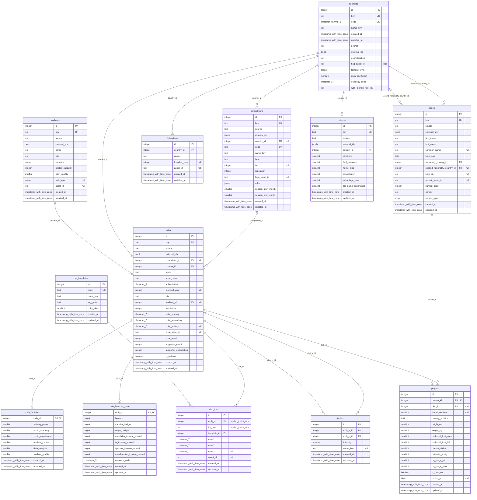

# Dünya Çekirdeği Şeması — Master World

> **Durum: TAMAMLANDI (Faz 3.10).** Tablo envanteri 3.6'da kapandı, sütun
> tanımları 3.4–3.6'da yazıldı, indeksler 3.7'de eklendi, **ER diyagramı 3.10'da
> gerçek şemadan üretildi.**
>
> **Otorite sırası:** `docs/spec/01-database.md` (sütun tanımları) →
> `docs/ROADMAP.md` Faz 3 tablo envanteri (kapsam kararları) → bu dosya (özet).
> Çelişki olursa spec kazanır.

## Diyagram nasıl üretiliyor — ve kim denetliyor

3.1'de bu dosyanın başlığında bir söz vardı: *"3.10'da gerçek şemadan üretilecek
ve tablo/FK sayısı programatik olarak karşılaştırılacak."* Aşağıdaki blok o
sözün karşılığı — **elle çizilmedi.**

**Neden:** şemanın zaten iki temsili var — Drizzle TS tanımları
(`packages/db/src/schema/`) ve migration SQL'i (`packages/db/drizzle/`) — ve
çalışan veritabanını **yalnızca ikincisi** kuruyor. Bu, 3.9'da ölçülmüş bir
bulgu: TS dosyasındaki bir `onDelete` mutasyonu, katalogdan okuyan hiçbir testi
etkilemiyor. Elle çizilmiş bir mermaid **üçüncü** temsil olurdu ve üçüncüsünü
hiçbir şey denetlemez; nöbetçisiz bir belge bir sonraki şema değişikliğinde
sessizce yalan söylemeye başlar.

| | |
|---|---|
| **Üretici** | `packages/db/src/schema-state/er-diagram.ts` — saf, `SchemaFacts` alır, metin döner |
| **Girdi** | `introspectSchema()` → gerçek `information_schema` + `pg_catalog` |
| **Nöbetçi** | `packages/db/integration/er-diagram.itest.ts` (`pnpm test:db`, CI'da amd64 + arm64) |
| **Ne iddia ediliyor** | ① belgedeki blok, canlı katalogdan üretilen metnin **birebir** aynısı ② belge metninden **sayılan** tablo/ilişki sayısı katalogla **ve** bugünün değerleriyle (11 / 12) aynı ③ **negatif:** blok bozulursa karşılaştırma kırılır |

⚠️ **Bu blok elle düzenlenmez.** Yeni bir migration burayı bayatlatır ve nöbetçi
kırılır. **Doğru düzeltme:** testin hata mesajı üretilmiş metnin **tamamını**
`----- ÜRETİLMİŞ METİN -----` işaretleri arasında basıyor; o blok olduğu gibi
buraya kopyalanır ve `er-diagram.itest.ts`'teki `EXPECTED_TABLE_COUNT` /
`EXPECTED_FOREIGN_KEY_COUNT` sabitleri güncellenir. Elle düzeltmek üçüncü
temsili geri getirir.

⚠️ **Kurtarma yolunun ilk hâli YETERSİZDİ ve ölçümle bulundu (3.10).** Önce
*"fark çıktısındaki metni kopyala"* yazıyordu; Vitest gerçekte **bağlamı
sınırlı bir birleşik fark** basıyor (`@@ -131,25 +131,10 @@`), metnin tamamını
değil. Üstelik yön **ters okunmaya açık**: `- Expected` satırları **üretilmiş**
(doğru) taraf, `+ Received` **bayat belge** — karıştırılırsa bayat metin geri
yazılır ve **test yeşile döner**. Sessiz bir yanlış düzeltme. Bu yüzden doğru
metin artık hata mesajının **içinde** duruyor ve fark okunmasına gerek yok.

✅ **Render 3.10'da ölçüldü** — `mermaid-cli 11.16.0` (tek seferlik, repoya
bağımlılık **eklenmedi**): 403 KB SVG, hata kutusu yok, on bir varlık adının
her biri birebir bir kez, işaretler 9 `PK` + 2 `PK,FK` + 10 `FK` + 8 `UK`.
⚠️ **Bu kalıcı bir kapı DEĞİL.** Nöbetçi diyagramın **içeriğini** koruyor
(katalogla birebir aynı mı), **sözdizimini** koruyan bir şey yok — sürekli
koşan bir render kontrolü bir `mermaid` bağımlılığı ve tarayıcı indirmesi
ister (K12). Üretici sözdizimini bilerek `erDiagram`ın **en dar** alt
kümesinde tutuyor; yine de şema değişince render **tek seferlik yeniden
ölçülür**.

## Kapsam

Faz 3 **11 master tablo** tanımlar. Bunlar tüm kayıtlar tarafından paylaşılır ve
**asla kullanıcı işlemiyle değiştirilmez** (K4) — kullanıcıya özel her değişiklik
`save_deltas`'a yazılır (Faz 12).

Sayı üç farklı yerde üç farklı şekilde yazılıydı ve Faz 3.1'de mutabakata bağlandı:
ROADMAP **15** diyordu, `spec/01` §3.1 bu kapsam için **11** tanımlıyordu,
`PROJECT_MEMORY.md` Faz 2 kaydı §11 **"16 master tablo"** diyordu. Karar tablosu ve
her satırın gerekçesi `docs/ROADMAP.md` → *Faz 3 — Tablo envanteri*'nde (SAPMA-021).

## ER Diyagramı (13 tablo · 16 yabancı anahtar)



### Diyagram nasıl okunur — her işaret bir TÜRETME

Hiçbir işaret elle konmadı; her biri katalogdan çıkan bir kuralın sonucu.
Kuralların tamamı ve gerekçeleri `er-diagram.ts` başlığında.

| İşaret | Anlamı | Nereden türetiliyor |
|---|---|---|
| `PK` | Birincil anahtar sütunu | `pg_constraint` `contype = 'p'` |
| `FK` | Yabancı anahtar sütunu | `contype = 'f'` |
| `UK` | **Tek sütunlu** benzersizlik | `contype = 'u'`, tek sütunlu olanlar |
| `"null"` | Sütun `NULL` kabul ediyor | `information_schema.columns.is_nullable` |
| `"uq:a+b"` | **Çok** sütunlu benzersizliğin parçası | `contype = 'u'`, çok sütunlu olanlar |
| `\|\|--` | FK sütunlarının hepsi `NOT NULL` | `pg_attribute.attnotnull` |
| `\|o--` | FK sütunlarından en az biri `NULL` kabul ediyor | aynı |
| `--o\|` | 1:1 — FK sütunları bir PK/UNIQUE kısıtını **tam** kaplıyor | kısıt sütun listeleri |
| `--o{` | 1:N | aynı |

⚠️ **Çok sütunlu bir `UNIQUE` sütun başına `UK` ALMIYOR** — `club_kits`'in
`(club_id, kit_type)` kısıtı için `club_id`'ye `UK` yazmak *"club_id tek başına
benzersiz"* demek olurdu ve **yanlış** olurdu. O kısıt yorum alanında.

⚠️ **Sağ uç her zaman `o` ile başlıyor** (*"sıfır veya"*): katalog bir çocuk
satırının **var olma zorunluluğunu** bilmiyor. `clubs`a bağlı bir
`club_facilities` satırı olmayabilir ve bunu yasaklayan bir kısıt yok — `|{`
yazmak ölçülmemiş bir iddia olurdu.

⚠️ **Tip adları kısaltılmadı** (`timestamp_with_time_zone`,
`character_varying_3`). Kısaltma bir **eşleme tablosu** ister; o tablo Faz 4 yeni
bir tip getirdiğinde güncellenmeyi unutur ve mermaid sessizce bozulur. Ad
`data_type`'tan **türetiliyor**: küçük harf, alfanümerik olmayan diziler `_`,
uzunluk varsa sona. Uzun ama her tip için doğru.

ℹ️ **Sütun sırası fiziksel sıradır**, TS tanımının sırası değil — `countries`'in
`created_at`/`updated_at` sütunlarının ortada görünmesinin sebebi bu
(`spec/01` §3.1.2 ④, `ALTER TABLE ADD COLUMN` sütunu **sona** ekler).

ℹ️ **Diyagramda görünmeyenler:** CHECK kısıtları, indeksler ve
`fms_meta.migrations`. İlk ikisi aşağıdaki tablolarda; üçüncüsü bilerek ayrı bir
şemada (`spec/01` §3.0 — tavuk-yumurta çözümü) ve `introspectSchema()` yalnızca
`public`'i okuyor.

## Tablolar (13)

| # | Tablo | Alt görev | `key`/`source`/`externalIds` | Not |
|---|---|---|---|---|
| 1 | `countries` | 3.2b / 3.4 | ✅ | İlk migration ve round-trip kanıtı bunun üzerinde |
| 2 | `federations` | 3.4 | — | `presidentPersonId` **Faz 4'te** |
| 3 | `competitions` | 3.4 | ✅ | `rules jsonb` (Zod: `CompetitionRules`), ayrı tablo değil |
| 4 | `clubs` | 3.5 | ✅ | `reputation` ve üç renk **sütun** olarak burada; `chairmanPersonId` **Faz 4'te**. ⚠️ `competitionId` ve `stadiumId` **nullable** — milli takımın (Faz 41, `isNational`) ne ligi ne sabit sahası var (SAPMA-026'nın türetme kuralı) |
| 5 | `club_facilities` | 3.5 | — | `clubId` 1:1 (PK = FK, ayrı `id` yok) |
| 6 | `club_finances_base` | 3.5 | — | `clubId` 1:1 · başlangıç değerleri master, değişimi delta · `bigint` **`mode: 'bigint'`** (§3.1.2 ⑥) |
| 7 | `stadiums` | 3.5 | ✅ | `builtYear`/`assetId` nullable |
| 8 | `rivalries` | 3.5 | — | `clubAId` / `clubBId` → ikisi de `clubs`, `CASCADE`. **3.7:** `(least,greatest)` UNIQUE ifade indeksi çift tekliğini sıradan bağımsız kapatıyor; kalan tek delik `(A,A)` → Faz 11 (G-11 daraldı) |
| 9 | `kit_templates` | 3.6 | — | Oyunun kendi 20 SVG şablonu, pakette değil (`spec/12` §17.2'de `templates.json` **yok** — ölçüldü) — `code` **UNIQUE**, `key`in rolünü görüyor. `colorSlots` **CHECK (2,3)**: sayısal ama kapalı küme (§3.1.2 ②, 4. satır) |
| 10 | `club_kits` | 3.6 | — | `(clubId, kitType)` **UNIQUE** · `kitType` CHECK · `templateId` → **RESTRICT** (sözlük tablosu, §3.1.2 ⑧). ⚠️ `assetId` `spec/01`'de **yoktu**, eklendi (SAPMA-026 EK): `spec/12` §17.4 gerçek forma görselini veriyor ve `null` = şablondan üret (K9) |
| 11 | `referees` | 3.6 | ✅ | `personId` **Faz 4.4'te** → o âna kadar **isimsiz**. Pakette `referees.json` yok, v1'de `source = 'procedural'`; `key` yine de zorunlu (§3.1.0: anahtar **adreslenebilirliğin** koşulu) |
| 12 | `people` | **4.3** | ✅ | Oyuncu/personel/menajer/başkan **ortak kimlik**. §3.1.0'ın altıncı taşıyıcısı — karar ölçüldü (4.0b Karar 3: `key`i `people` taşırsa FK kuralı 20/20, `players` taşırsa 17/20). `personType` **şemanın ilk dizi sütunu** (`text[]`, CHECK: boş olamaz + kapalı küme) · `gender` CHECK · ikinci uyruk **nullable ama RESTRICT** (kural ② ③'ten önce) |
| 13 | `players` | **4.3** | — | `personId` **UNIQUE FK** → CASCADE · `clubId` **nullable** → **şemanın ilk `ON DELETE SET NULL`ı** (*"null = serbest oyuncu"*). ⚠️ Faz 3'ün 1:1 desenini **izlemiyor** (ayrı `serial id`) ve gerekçe ölçüldü: ona bakan 13 tablo var (5 master + 8 save), `club_facilities`'e bakan **0**. `primaryPosition` CHECK (12 mevki) · `isNewgen` **DEFAULT ALMIYOR**. `CA <= PA` ve PA bandı CHECK'leri **4.5'te** |

> ✅ **FAZ 3'ÜN ENVANTERİ KAPANDI — 11/11 (Faz 3.6); FAZ 4 ONU BÜYÜTÜYOR (13, 4.3).**
> Sayı gözle sayılmıyor:
> `packages/db/integration/schema-constraints.itest.ts` gerçek
> `information_schema`'dan okuyup tablo adlarını tek tek iddia ediyor,
> `round-trip.itest.ts` aynı listeyi çevrimin iki ucunda karşılaştırıyor ve
> **3.10'dan itibaren** `er-diagram.itest.ts` sayıyı bu belgenin metninden de
> okuyup katalogla karşılaştırıyor.
> ⏳ **Faz 4'ün kalan dokuz master tablosu 4.5–4.7'de gelecek** (ROADMAP, SAPMA-030).
> Migration zinciri: `0000_countries_initial` · `0001_geography_institutions` ·
> `0002_club_core` · `0003_visual_assets_referees` · `0004_search_indexes` ·
> `0005_people_players` — **altısının da elle yazılmış `down`u var**.

## Yabancı anahtarlar — bir LİSTE değil, bir KURAL (3.9)

On altı FK'nın `ON DELETE` davranışı elle sayılmıyor; `spec/01` §3.1.2 ③ + ⑧'den
**türetiliyor** (`packages/db/src/schema/fk-policy.ts`) ve entegrasyon testi
türetilen değeri `pg_constraint`teki gerçekle karşılaştırıyor: **16/16, 0
uyumsuzluk** (PG 18.6). Faz 4.3'ün dört yeni FK'sı **hiçbir liste
güncellenmeden** denetlendi — kuralın var olma sebebi buydu.

```
① hedef dictionary                → RESTRICT
② kaynak independent              → RESTRICT      ← ③'TEN ÖNCE
③ FK'nın BÜTÜN sütunları nullable → SET NULL      (4.2'de eklendi)
④ kaynak satellite (NOT NULL)     → CASCADE

`key` var                → independent
`key` yok + giden FK var → satellite
`key` yok + giden FK yok → dictionary
```

⚠️ **③'ün İLK CANLI VAKASI 4.3'te geldi: `players.club_id` → `SET NULL`.**
4.2 kuralı yazdığında canlı katalogda o dala düşen tek bir FK yoktu. Kuralın
katalogla uyuşması veritabanının öyle *davrandığını* göstermediği için davranış
ayrıca ölçülüyor: kulüp silinince oyuncu **duruyor** ve `club_id` **NULL**,
karşı örnekte kişi silinince oyuncu **gidiyor**.

⚠️ **Nullable olmak `SET NULL` almak DEMEK DEĞİL.** Bugün beş FK'nın kaynak
sütunları tümüyle nullable ama yalnızca **biri** `SET NULL` alıyor; diğer dördü
`independent` bir tablodan çıktığı için ②'de RESTRICT'te duruyor
(`people.second_nationality_country_id` bunun en net örneği).

§3.1.2 ⑧'in *"sahipsiz"* kelimesi ölçülebilir bir koşula çevrildi ve
`kit_templates` **adı hiçbir yerde yazılmadan** bulunuyor. **Faz 12**'nin
`injury_types` tablosu aynı koşulu sağlayacak; `staff_roles` **açılmıyor**
(4.1'de ölçüldü — `staff.role` bir CHECK).

ℹ️ Elle yazılmış tam envanter testi **korundu**: liste *"bugün şunlar var"*,
kural *"olması gereken bu"* diyor. Yalnızca kural kalsaydı, kuralın kendisi
yanlış olduğunda hiçbir şey ötmezdi.

## Faz 3'te bilerek YAPILMAYANLAR

| Ne | Neden | Nereye |
|---|---|---|
| `confederations`, `competition_rules`, `club_reputations`, `club_colors` tabloları | Hepsi 1:1 sütun; ayrı tablo her sorguya JOIN ekler, hiçbir sorgu onlardan geçmez (K12) | — (sütun olarak `spec/01`'de) |
| `competition_seasons` | **Hiçbir tüketicisi yok** — `spec/01`, `spec/12`, ROADMAP Faz 8/46/47 tarandı. Sezon bu spec'te **skaler `seasonYear`**, puan durumu `matches`'tan türetiliyor | — · ürün fikri `docs/V2-BACKLOG.md`'ye |
| `asset_index` | `spec/12` §17.5 istiyor ama tabloyu **dolduran hat** Faz 7'de. Hiçbir şeyin yazmadığı tablo, tüketicisi olmayan sütunla aynı sınıf | **Faz 7** (G-09) |
| `federations.presidentPersonId`, `clubs.chairmanPersonId`, `referees.personId` | `people` Faz 4'te. Kısıtsız sütun, *"tüm FK'lar tanımlı"* kriterini görünürde sağlayıp gerçekte delerdi | **Faz 4** — sütun ve FK **birlikte** eklenecek |

## Kararların dayanağı

- **Salt-okunurluk (K4)** tip seviyesinde zorlanır, `is_master` gibi bir bayrak
  sütunuyla değil — hiçbir şeyin tüketmediği bir bayrak bir temennidir. Uygulama 3.3.
- **Veri paketi sütunları** (`key` · `source` · `externalIds`) ve `key`'in
  **tablo başına** benzersizliği: `docs/spec/01-database.md` **§3.1.0**.
- **Migration `up`/`down` disiplini** ve `drizzle-kit`in `down` üretmediği ölçümü:
  `docs/spec/01-database.md` **§3.0**.
- **Şema yazım kuralları (on madde)** — `check()` desteği, CHECK'in yeri,
  `ON DELETE` kuralı, sütun sırası, `attnum` deliği, `bigint` modu, `down`
  sırası, sözlük tabloları, `IMMUTABLE` iddiası, uzantı `down`u:
  `docs/spec/01-database.md` **§3.1.2**. Burada tekrarlanmıyor — iki kopya
  kaçınılmaz olarak ayrışır.
- **Collation ve arama:** veritabanı `builtin`/`C.UTF-8`; sıralama sorgu başına
  `COLLATE "tr-TR-x-icu"`. Türkçe arama için `unaccent` **şart** ve `IMMUTABLE`
  sarmalayıcı istiyor — ölçüm ROADMAP Faz 3.7 ve Faz 8 maddelerinde.

## İndeksler (Faz 3.7)

| İndeks | Tablo | Tür | Tüketici |
|---|---|---|---|
| `clubs_competition_id_idx` | `clubs` | btree | `ON DELETE RESTRICT` denetimi (bugün) · lig kadrosu sorgusu (Faz 16/18) |
| `competitions_country_id_idx` | `competitions` | btree | `ON DELETE RESTRICT` denetimi (bugün) |
| `clubs_name_trgm_idx` | `clubs` | **GIN** `immutable_unaccent(lower(name)) gin_trgm_ops` | Faz 8 kabul kriteri (`besiktas` → `Beşiktaş`) · Faz 17 global arama |
| `rivalries_pair_unique_idx` | `rivalries` | **UNIQUE** `(least(a,b), greatest(a,b))` | Çift tekliği — sıradan bağımsız (G-11 daraldı) |

⚠️ PostgreSQL FK sütunlarını **otomatik indekslemiyor**; ilk iki indeksin
tüketicisi gelecekte değil **bugün**.

⚠️ **`clubs_competition_id_idx`'in v1'deki tüketicisi bir kullanıcı sorgusu
DEĞİL** (3.9'da ölçüldü). Planlayıcı bu indeksi **240 satırda seçmiyor, 500
satırda seçiyor**; v1'in gerçekçi hacmi **~118 kulüp** (ROADMAP Faz 8). Yani
indeksin bugünkü işi `ON DELETE RESTRICT` denetimini hızlandırmak. Bu bir
başarısızlık değil, indeksin **gerçek gerekçesi** — yazılmazsa Faz 32 onu
yanlış sebeple miras alır.

⚠️ **Plan seçimi hacme değil SEÇİCİLİĞE bağlı** (3.9). Aynı tabloda, aynı 3.001
satırda: `'besiktas'` GIN indeksini kullanıyor, `'kulup1234'` Seq Scan'e
düşüyor. İkisi de doğru karar. *"N satırda indeks kullanılıyor"* bir kural
değildir.

⚠️ `competitions`a trigram indeksi **konmadı**: görünen adı `name_key`, bir i18n
anahtarı. ROADMAP Faz 17 lig/turnuva aramasını da istiyor → **G-13**.

⚠️ `immutable_unaccent` bir **iddia** (`unaccent` gerçekte `STABLE`). Bedeli ve
nöbetçisi `docs/spec/01-database.md` §3.1.2 **⑨**'da.
