# Dünya Çekirdeği Şeması — Master World

> **Durum: FAZ 3 + FAZ 4 KAPANDI (son güncelleme 4.11).** Faz 3'ün on bir
> tablosu 3.6'da, Faz 4'ün on bir tablosu 4.7'de kapandı; sütun tanımları
> 3.4–3.6 ve 4.3–4.7'de yazıldı, indeksler **iki turda** geldi (3.7 → dört ·
> 4.8 → iki), **ER diyagramı 3.10'dan beri gerçek şemadan üretiliyor.**
>
> **Otorite sırası:** `docs/spec/01-database.md` (sütun tanımları) →
> `docs/ROADMAP.md` Faz 3 ve Faz 4 tablo envanterleri (kapsam kararları) → bu
> dosya (özet). Çelişki olursa spec kazanır.
>
> ⚠️ **BU BAŞLIK 4.11'DE DÜZELTİLDİ ve düzeltmenin sebebi bir DESEN.** Eski hâli
> *"TAMAMLANDI (Faz 3.10) … indeksler 3.7'de eklendi"* diyordu ve **dört alt
> görev** boyunca öyle kaldı. Mermaid bloğunu koşan bir nöbetçi koruyor
> (`er-diagram.itest.ts`); **prose'u hiçbir şey korumuyor** — o yüzden blok
> güncelken metin bayatlayabiliyor, ve bu dosyada 4.11'de **dört yerde birden**
> bayatlamış bulundu (bu başlık · tablo envanteri · FK sayısı · indeks listesi).
> Nöbetçinin kapsamı burada yazılı olsun ki bir sonraki tur *"test geçti, belge
> günceldir"* diye okumasın.

## Diyagram nasıl üretiliyor — ve kim denetliyor

3.1'de bu dosyanın başlığında bir söz vardı: *"3.10'da gerçek şemadan üretilecek
ve tablo/FK sayısı programatik olarak karşılaştırılacak."* Aşağıdaki blok o
sözün karşılığı — **elle çizilmedi.**

**Neden:** şemanın zaten iki temsili var — Drizzle TS tanımları
(`packages/db/src/schema/`) ve migration SQL'i (`packages/db/drizzle/`) — ve
çalışan veritabanını **yalnızca ikincisi** kuruyor. Bu, 3.9'da ölçülmüş bir
bulgu: TS dosyasındaki bir `onDelete` mutasyonu, katalogdan okuyan hiçbir testi
etkilemiyor. Elle çizilmiş bir mermaid **üçüncü** temsil olurdu ve üçüncüsünü
hiçbir şey denetlemez; nöbetçisiz bir belge bir sonraki şema değişikliğinde
sessizce yalan söylemeye başlar.

| | |
|---|---|
| **Üretici** | `packages/db/src/schema-state/er-diagram.ts` — saf, `SchemaFacts` alır, metin döner |
| **Girdi** | `introspectSchema()` → gerçek `information_schema` + `pg_catalog` |
| **Nöbetçi** | `packages/db/integration/er-diagram.itest.ts` (`pnpm test:db`, CI'da amd64 + arm64) |
| **Ne iddia ediliyor** | ① belgedeki blok, canlı katalogdan üretilen metnin **birebir** aynısı ② belge metninden **sayılan** tablo/ilişki sayısı katalogla **ve** bugünün değerleriyle (22 / 32) aynı ③ **negatif:** blok bozulursa karşılaştırma kırılır |

⚠️ **Bu blok elle düzenlenmez.** Yeni bir migration burayı bayatlatır ve nöbetçi
kırılır. **Doğru düzeltme:** testin hata mesajı üretilmiş metnin **tamamını**
`----- ÜRETİLMİŞ METİN -----` işaretleri arasında basıyor; o blok olduğu gibi
buraya kopyalanır ve `er-diagram.itest.ts`'teki `EXPECTED_TABLE_COUNT` /
`EXPECTED_FOREIGN_KEY_COUNT` sabitleri güncellenir. Elle düzeltmek üçüncü
temsili geri getirir.

⚠️ **Kurtarma yolunun ilk hâli YETERSİZDİ ve ölçümle bulundu (3.10).** Önce
*"fark çıktısındaki metni kopyala"* yazıyordu; Vitest gerçekte **bağlamı
sınırlı bir birleşik fark** basıyor (`@@ -131,25 +131,10 @@`), metnin tamamını
değil. Üstelik yön **ters okunmaya açık**: `- Expected` satırları **üretilmiş**
(doğru) taraf, `+ Received` **bayat belge** — karıştırılırsa bayat metin geri
yazılır ve **test yeşile döner**. Sessiz bir yanlış düzeltme. Bu yüzden doğru
metin artık hata mesajının **içinde** duruyor ve fark okunmasına gerek yok.

✅ **Render 4.11'de YENİDEN ÖLÇÜLDÜ — çünkü bu paragrafın kendi kuralı öyle
diyordu ve şema 11 varlıktan 22'ye çıkmıştı.** `mermaid-cli 11` (tek seferlik,
repoya bağımlılık **eklenmedi** — `pnpm-lock.yaml` diff yok, ölçüldü):

| | 3.10 (11 varlık) | **4.11 (22 varlık)** |
|---|---|---|
| SVG | 403 KB | **954.908 bayt** |
| Hata kutusu | yok | **yok** |
| Varlık adı birebir bir kez | 11/11 | **22/22** |
| İşaretler | 9 `PK` · 2 `PK,FK` · 10 `FK` · 8 `UK` | **15 `PK` · 8 `PK,FK` · 23 `FK` · 9 `UK`** |

⚠️ **İşaretler İKİ KAYNAKTAN sayıldı ve karşılaştırıldı** — üretilmiş metin
(`.mmd`) ve render (`.svg`): **4/4 uyuşuyor**. Tek kaynaktan sayılsaydı,
render'ın bir işareti düşürmesi görünmezdi.

⚠️ **VE ÖLÇÜM ARACI İKİ KEZ YANLIŞ CEVAP ÜRETTİ (D2), ikisi de aynı koşuda
yakalandı:** ① *"hata kutusu"* dedektörü `error-icon` arıyordu ve **yanlış
pozitif** verdi — o dize mermaid'in **varsayılan CSS'inde** duruyor
(`.error-icon{fill:#552222;}`), bir hata kutusu değil bir stil kuralı; gerçek
imzalar (`aria-roledescription="error"`, görünür `Syntax error`) ikisi de **0**.
② `.mmd` işaret sayacı işareti **satır sonunda** arıyordu, oysa yorumlu
nitelikler tırnaklı bir metinle bitiyor (`integer club_id FK "null"`) — `FK`
**12** sayıldı, gerçek **23**. Uyuşmazlığı gösteren şey, iki kaynaklı sayımın
kendisiydi.

ℹ️ **Bu hâlâ kalıcı bir kapı DEĞİL** (aşağıdaki gerekçe geçerli); ama kural
artık bir kez daha koştu ve **koştuğu kaydedildi** — *"şema değişince yeniden
ölçülür"* cümlesi 3.10'dan 4.11'e kadar ateşlenmemişti.
⚠️ **Bu kalıcı bir kapı DEĞİL.** Nöbetçi diyagramın **içeriğini** koruyor
(katalogla birebir aynı mı), **sözdizimini** koruyan bir şey yok — sürekli
koşan bir render kontrolü bir `mermaid` bağımlılığı ve tarayıcı indirmesi
ister (K12). Üretici sözdizimini bilerek `erDiagram`ın **en dar** alt
kümesinde tutuyor; yine de şema değişince render **tek seferlik yeniden
ölçülür**.

## Kapsam

Faz 3 **11 master tablo** tanımlar. Bunlar tüm kayıtlar tarafından paylaşılır ve
**asla kullanıcı işlemiyle değiştirilmez** (K4) — kullanıcıya özel her değişiklik
`save_deltas`'a yazılır (Faz 12).

Sayı üç farklı yerde üç farklı şekilde yazılıydı ve Faz 3.1'de mutabakata bağlandı:
ROADMAP **15** diyordu, `spec/01` §3.1 bu kapsam için **11** tanımlıyordu,
`PROJECT_MEMORY.md` Faz 2 kaydı §11 **"16 master tablo"** diyordu. Karar tablosu ve
her satırın gerekçesi `docs/ROADMAP.md` → *Faz 3 — Tablo envanteri*'nde (SAPMA-021).

**Faz 4 on bir tablo ekledi ve envanteri 4.7'de KAPADI** — diyagram başlığındaki
sayı (22) o yüzden 11'den büyük: 11 (Faz 3) + 11 (Faz 4).

| Alt görev | Tablolar | Migration |
|---|---|---|
| 4.3 | `people` · `players` | `0005` |
| 4.5 | `player_attributes` · `player_hidden_attributes` | `0007` |
| 4.6 | `player_positions` · `player_traits` · `player_stats_history` | `0009` |
| **4.7** | **`staff` · `staff_attributes` · `managers` · `manager_attributes`** | **`0010`** |

⚠️ **Bu tablo bir ENVANTER değil, bir izleme notudur** — koşan envanter
`round-trip.itest.ts`teki `ALL_TABLES` ve `schema-constraints.itest.ts`teki
`information_schema` sorgusu. İkisi ayrışırsa **testler** öter, bu satırlar
değil.

## ER Diyagramı (22 tablo · 32 yabancı anahtar)

```mermaid
erDiagram
    clubs ||--o| club_facilities : "club_id"
    clubs ||--o| club_finances_base : "club_id"
    clubs ||--o{ club_kits : "club_id"
    kit_templates ||--o{ club_kits : "template_id"
    people |o--o{ clubs : "chairman_person_id"
    competitions |o--o{ clubs : "competition_id"
    countries ||--o{ clubs : "country_id"
    stadiums |o--o{ clubs : "stadium_id"
    countries |o--o{ competitions : "country_id"
    countries ||--o{ federations : "country_id"
    people |o--o{ federations : "president_person_id"
    managers ||--o| manager_attributes : "manager_id"
    clubs |o--o{ managers : "club_id"
    people ||--o{ managers : "person_id"
    countries ||--o{ people : "nationality_country_id"
    countries |o--o{ people : "second_nationality_country_id"
    players ||--o| player_attributes : "player_id"
    players ||--o| player_hidden_attributes : "player_id"
    players ||--o{ player_positions : "player_id"
    clubs |o--o{ player_stats_history : "club_id"
    competitions ||--o{ player_stats_history : "competition_id"
    players ||--o{ player_stats_history : "player_id"
    players ||--o{ player_traits : "player_id"
    clubs |o--o{ players : "club_id"
    people ||--o| players : "person_id"
    countries ||--o{ referees : "country_id"
    people ||--o{ referees : "person_id"
    clubs ||--o{ rivalries : "club_a_id"
    clubs ||--o{ rivalries : "club_b_id"
    staff ||--o| staff_attributes : "staff_id"
    clubs |o--o{ staff : "club_id"
    people ||--o{ staff : "person_id"

    club_facilities {
        integer club_id PK,FK
        smallint training_ground
        smallint youth_academy
        smallint youth_recruitment
        smallint medical_centre
        smallint data_analysis
        smallint stadium_quality
        timestamp_with_time_zone created_at
        timestamp_with_time_zone updated_at
    }

    club_finances_base {
        integer club_id PK,FK
        bigint balance
        bigint transfer_budget
        bigint wage_budget
        bigint matchday_income_annual
        bigint tv_income_annual
        bigint sponsor_income_annual
        bigint merchandise_income_annual
        character_3 currency_code
        timestamp_with_time_zone created_at
        timestamp_with_time_zone updated_at
    }

    club_kits {
        integer id PK
        integer club_id FK "uq:club_id+kit_type"
        text kit_type "uq:club_id+kit_type"
        integer template_id FK
        character_7 color1
        character_7 color2
        character_7 color3 "null"
        text asset_id "null"
        timestamp_with_time_zone created_at
        timestamp_with_time_zone updated_at
    }

    clubs {
        integer id PK
        text key UK
        text source
        jsonb external_ids
        integer competition_id FK "null"
        integer country_id FK
        text name
        text short_name
        character_3 abbreviation
        integer founded_year "null"
        text city
        integer stadium_id FK "null"
        integer reputation
        character_7 color_primary
        character_7 color_secondary
        character_7 color_tertiary "null"
        text crest_asset_id "null"
        integer crest_seed
        integer supporter_count
        integer supporter_expectation
        boolean is_national
        timestamp_with_time_zone created_at
        timestamp_with_time_zone updated_at
        integer chairman_person_id FK "null"
    }

    competitions {
        integer id PK
        text key UK
        text source
        jsonb external_ids
        integer country_id FK "null"
        text code UK
        text name_key
        text type
        integer tier "null"
        integer reputation
        text logo_asset_id "null"
        jsonb rules
        smallint season_start_month
        smallint season_end_month
        timestamp_with_time_zone created_at
        timestamp_with_time_zone updated_at
    }

    countries {
        integer id PK
        text key UK
        character_varying_3 code UK
        text name_key
        timestamp_with_time_zone created_at
        timestamp_with_time_zone updated_at
        text source
        jsonb external_ids
        text confederation
        text flag_asset_id "null"
        integer football_level
        numeric uefa_coefficient
        character_3 currency_code
        text work_permit_rule_key
    }

    federations {
        integer id PK
        integer country_id FK
        text name
        integer founded_year "null"
        text asset_id "null"
        timestamp_with_time_zone created_at
        timestamp_with_time_zone updated_at
        integer president_person_id FK "null"
    }

    kit_templates {
        integer id PK
        text code UK
        text name_key
        text svg_path
        smallint color_slots
        timestamp_with_time_zone created_at
        timestamp_with_time_zone updated_at
    }

    manager_attributes {
        integer manager_id PK,FK
        smallint tactical_knowledge
        smallint motivation
        smallint player_management
        smallint youth_development
        smallint negotiating
        smallint media_handling
        smallint training_management
        smallint judging_ability
        timestamp_with_time_zone created_at
        timestamp_with_time_zone updated_at
    }

    managers {
        integer id PK
        integer person_id FK
        integer club_id FK "null"
        boolean is_user_manager
        text coaching_badge
        text experience_level
        text philosophy
        smallint reputation
        integer experience_points
        array spoken_languages
        timestamp_with_time_zone created_at
        timestamp_with_time_zone updated_at
    }

    people {
        integer id PK
        text key UK
        text source
        jsonb external_ids
        text first_name
        text last_name
        text common_name "null"
        date birth_date
        integer nationality_country_id FK
        integer second_nationality_country_id FK "null"
        text birth_city "null"
        text portrait_asset_id "null"
        integer portrait_seed
        text gender
        array person_type
        timestamp_with_time_zone created_at
        timestamp_with_time_zone updated_at
    }

    player_attributes {
        integer player_id PK,FK
        smallint corners
        smallint crossing
        smallint dribbling
        smallint finishing
        smallint first_touch
        smallint free_kick_taking
        smallint heading
        smallint long_shots
        smallint long_throws
        smallint marking
        smallint passing
        smallint penalty_taking
        smallint tackling
        smallint technique
        smallint aggression
        smallint anticipation
        smallint bravery
        smallint composure
        smallint concentration
        smallint decisions
        smallint determination
        smallint flair
        smallint leadership
        smallint off_the_ball
        smallint positioning
        smallint teamwork
        smallint vision
        smallint work_rate
        smallint acceleration
        smallint agility
        smallint balance
        smallint jumping_reach
        smallint natural_fitness
        smallint pace
        smallint stamina
        smallint strength
        smallint aerial_reach
        smallint command_of_area
        smallint communication
        smallint eccentricity
        smallint handling
        smallint kicking
        smallint one_on_ones
        smallint reflexes
        smallint rushing_out
        smallint tendency_to_punch
        smallint throwing
        timestamp_with_time_zone created_at
        timestamp_with_time_zone updated_at
    }

    player_hidden_attributes {
        integer player_id PK,FK
        smallint consistency
        smallint important_matches
        smallint injury_proneness
        smallint dirtiness
        smallint pressure
        smallint professionalism
        smallint ambition
        smallint loyalty
        smallint adaptability
        smallint temperament
        timestamp_with_time_zone created_at
        timestamp_with_time_zone updated_at
    }

    player_positions {
        integer player_id PK,FK
        text position
        text level
        timestamp_with_time_zone created_at
        timestamp_with_time_zone updated_at
    }

    player_stats_history {
        integer id PK
        integer player_id FK
        integer season_year
        integer competition_id FK
        integer club_id FK "null"
        integer appearances
        integer minutes
        integer goals
        integer assists
        numeric xg
        numeric xa
        integer passes_attempted
        integer passes_completed
        integer progressive_passes
        integer dribbles_attempted
        integer dribbles_completed
        integer duels_won
        integer duels_total
        integer aerials_won
        integer aerials_total
        integer tackles
        integer interceptions
        integer blocks
        integer fouls_committed
        integer yellow_cards
        integer red_cards
        integer saves
        integer goals_conceded
        numeric xga
        integer clean_sheets
        integer penalties_saved
        timestamp_with_time_zone created_at
        timestamp_with_time_zone updated_at
    }

    player_traits {
        integer player_id PK,FK
        text trait_code PK
        timestamp_with_time_zone created_at
        timestamp_with_time_zone updated_at
    }

    players {
        integer id PK
        integer person_id FK,UK
        integer club_id FK "null"
        smallint squad_number "null"
        text primary_position
        smallint height_cm
        smallint weight_kg
        smallint preferred_foot_right
        smallint preferred_foot_left
        smallint current_ability
        smallint potential_ability
        smallint pa_range_min
        smallint pa_range_max
        boolean is_newgen
        date retired_at "null"
        timestamp_with_time_zone created_at
        timestamp_with_time_zone updated_at
    }

    referees {
        integer id PK
        text key UK
        text source
        jsonb external_ids
        integer country_id FK
        smallint strictness
        smallint foul_tolerance
        smallint home_bias
        smallint consistency
        smallint advantage_play
        smallint big_game_experience
        timestamp_with_time_zone created_at
        timestamp_with_time_zone updated_at
        integer person_id FK
    }

    rivalries {
        integer id PK
        integer club_a_id FK
        integer club_b_id FK
        smallint intensity
        text name_key "null"
        timestamp_with_time_zone created_at
        timestamp_with_time_zone updated_at
    }

    stadiums {
        integer id PK
        text key UK
        text source
        jsonb external_ids
        text name
        text city
        integer capacity
        integer seated_capacity
        smallint pitch_quality
        integer built_year "null"
        text asset_id "null"
        timestamp_with_time_zone created_at
        timestamp_with_time_zone updated_at
    }

    staff {
        integer id PK
        integer person_id FK
        integer club_id FK "null"
        text role
        timestamp_with_time_zone created_at
        timestamp_with_time_zone updated_at
    }

    staff_attributes {
        integer staff_id PK,FK
        smallint attacking
        smallint defending
        smallint fitness
        smallint goalkeeping
        smallint technical
        smallint tactical
        smallint motivating
        smallint discipline
        smallint judging_ability
        smallint judging_potential
        smallint physiotherapy
        smallint sports_science
        smallint scouting_network
        smallint adaptability
        smallint working_with_youngsters
        smallint negotiating
        timestamp_with_time_zone created_at
        timestamp_with_time_zone updated_at
    }
```



### Diyagram nasıl okunur — her işaret bir TÜRETME

Hiçbir işaret elle konmadı; her biri katalogdan çıkan bir kuralın sonucu.
Kuralların tamamı ve gerekçeleri `er-diagram.ts` başlığında.

| İşaret | Anlamı | Nereden türetiliyor |
|---|---|---|
| `PK` | Birincil anahtar sütunu | `pg_constraint` `contype = 'p'` |
| `FK` | Yabancı anahtar sütunu | `contype = 'f'` |
| `UK` | **Tek sütunlu** benzersizlik | `contype = 'u'`, tek sütunlu olanlar |
| `"null"` | Sütun `NULL` kabul ediyor | `information_schema.columns.is_nullable` |
| `"uq:a+b"` | **Çok** sütunlu benzersizliğin parçası | `contype = 'u'`, çok sütunlu olanlar |
| `\|\|--` | FK sütunlarının hepsi `NOT NULL` | `pg_attribute.attnotnull` |
| `\|o--` | FK sütunlarından en az biri `NULL` kabul ediyor | aynı |
| `--o\|` | 1:1 — FK sütunları bir PK/UNIQUE kısıtını **tam** kaplıyor | kısıt sütun listeleri |
| `--o{` | 1:N | aynı |

⚠️ **Çok sütunlu bir `UNIQUE` sütun başına `UK` ALMIYOR** — `club_kits`'in
`(club_id, kit_type)` kısıtı için `club_id`'ye `UK` yazmak *"club_id tek başına
benzersiz"* demek olurdu ve **yanlış** olurdu. O kısıt yorum alanında.

⚠️ **Sağ uç her zaman `o` ile başlıyor** (*"sıfır veya"*): katalog bir çocuk
satırının **var olma zorunluluğunu** bilmiyor. `clubs`a bağlı bir
`club_facilities` satırı olmayabilir ve bunu yasaklayan bir kısıt yok — `|{`
yazmak ölçülmemiş bir iddia olurdu.

⚠️ **Tip adları kısaltılmadı** (`timestamp_with_time_zone`,
`character_varying_3`). Kısaltma bir **eşleme tablosu** ister; o tablo Faz 4 yeni
bir tip getirdiğinde güncellenmeyi unutur ve mermaid sessizce bozulur. Ad
`data_type`'tan **türetiliyor**: küçük harf, alfanümerik olmayan diziler `_`,
uzunluk varsa sona. Uzun ama her tip için doğru.

ℹ️ **Sütun sırası fiziksel sıradır**, TS tanımının sırası değil — `countries`'in
`created_at`/`updated_at` sütunlarının ortada görünmesinin sebebi bu
(`spec/01` §3.1.2 ④, `ALTER TABLE ADD COLUMN` sütunu **sona** ekler).

ℹ️ **Diyagramda görünmeyenler:** CHECK kısıtları, indeksler ve
`fms_meta.migrations`. İlk ikisi aşağıdaki tablolarda; üçüncüsü bilerek ayrı bir
şemada (`spec/01` §3.0 — tavuk-yumurta çözümü) ve `introspectSchema()` yalnızca
`public`'i okuyor.

## Tablolar (22)

| # | Tablo | Alt görev | `key`/`source`/`externalIds` | Not |
|---|---|---|---|---|
| 1 | `countries` | 3.2b / 3.4 | ✅ | İlk migration ve round-trip kanıtı bunun üzerinde |
| 2 | `federations` | 3.4 / **4.4** | — | `presidentPersonId` **4.4'te geldi** → **`ON DELETE SET NULL`**. ⚠️ Tablo artık **iki FK'nın iki farklı cevabını** taşıyor: `countryId` NOT NULL → CASCADE (*sahiplik*), `presidentPersonId` nullable → SET NULL (*referans*) |
| 3 | `competitions` | 3.4 | ✅ | `rules jsonb` (Zod: `CompetitionRules`), ayrı tablo değil |
| 4 | `clubs` | 3.5 | ✅ | `reputation` ve üç renk **sütun** olarak burada; `chairmanPersonId` **4.4'te geldi** → nullable **ama `RESTRICT`** (kaynak `independent`; kural ② ③'ten önce). ⚠️ `competitionId` ve `stadiumId` **nullable** — milli takımın (Faz 41, `isNational`) ne ligi ne sabit sahası var (SAPMA-026'nın türetme kuralı) |
| 5 | `club_facilities` | 3.5 | — | `clubId` 1:1 (PK = FK, ayrı `id` yok) |
| 6 | `club_finances_base` | 3.5 | — | `clubId` 1:1 · başlangıç değerleri master, değişimi delta · `bigint` **`mode: 'bigint'`** (§3.1.2 ⑥) |
| 7 | `stadiums` | 3.5 | ✅ | `builtYear`/`assetId` nullable |
| 8 | `rivalries` | 3.5 | — | `clubAId` / `clubBId` → ikisi de `clubs`, `CASCADE`. **3.7:** `(least,greatest)` UNIQUE ifade indeksi çift tekliğini sıradan bağımsız kapatıyor; kalan tek delik `(A,A)` → Faz 11 (G-11 daraldı) |
| 9 | `kit_templates` | 3.6 | — | Oyunun kendi 20 SVG şablonu, pakette değil (`spec/12` §17.2'de `templates.json` **yok** — ölçüldü) — `code` **UNIQUE**, `key`in rolünü görüyor. `colorSlots` **CHECK (2,3)**: sayısal ama kapalı küme (§3.1.2 ②, 4. satır) |
| 10 | `club_kits` | 3.6 | — | `(clubId, kitType)` **UNIQUE** · `kitType` CHECK · `templateId` → **RESTRICT** (sözlük tablosu, §3.1.2 ⑧). ⚠️ `assetId` `spec/01`'de **yoktu**, eklendi (SAPMA-026 EK): `spec/12` §17.4 gerçek forma görselini veriyor ve `null` = şablondan üret (K9) |
| 11 | `referees` | 3.6 / **4.4** | ✅ | `personId` **4.4'te geldi** → hakemler artık isimli. Üç ileri FK'nın **tek `NOT NULL`u** → `RESTRICT`; bedeli: `0006` dolu bir `referees` tablosunda yeniden uygulanamıyor (gürültülü, kendi testi var). ✅ **G-18 4.5'te KAPANDI** (`0008`): `person_type` kümesi artık `'referee'` taşıyor. 🆕 Açık boşluk **G-19**: hiçbir faz hakem verisini **ingest etmiyor** (23/26/29/45 tüketici, 46 bakım; 8 ve 9'un listelerinde hakem yok). Pakette `referees.json` yok, v1'de `source = 'procedural'`; `key` yine de zorunlu (§3.1.0: anahtar **adreslenebilirliğin** koşulu) |
| 12 | `people` | **4.3** / **4.5** | ✅ | Oyuncu/personel/menajer/başkan/**hakem** **ortak kimlik**. §3.1.0'ın altıncı taşıyıcısı — karar ölçüldü (4.0b Karar 3: `key`i `people` taşırsa FK kuralı 20/20, `players` taşırsa 17/20). `personType` **şemanın ilk dizi sütunu** (`text[]`, CHECK: boş olamaz + kapalı küme). **4.5 kümeyi 4 → 5 değere çıkardı** (`'referee'`, `0008`) ve bedeli ölçüldü: `0008`in `down`u dolu bir `people` tablosunda **gürültülü patlıyor** — kısıt daraltmak veriyi doğrulamaktır · `gender` CHECK · ikinci uyruk **nullable ama RESTRICT** (kural ② ③'ten önce) |
| 13 | `players` | **4.3** / **4.5** | — | `personId` **UNIQUE FK** → CASCADE · `clubId` **nullable** → **şemanın ilk `ON DELETE SET NULL`ı** (*"null = serbest oyuncu"*). ⚠️ Faz 3'ün 1:1 desenini **izlemiyor** (ayrı `serial id`) ve gerekçe ölçüldü: ona bakan 13 tablo var (5 master + 8 save), `club_facilities`'e bakan **0**. `primaryPosition` CHECK (12 mevki) · `isNewgen` **DEFAULT ALMIYOR**. ✅ **İki ilişki değişmezi 4.5'te geldi** (`0007`): `players_ca_le_pa_check` ve `players_pa_range_check` — **iki ayrı kısıt**, birleşik değil (hangi değişmezin ihlal edildiği hata mesajından okunsun) |
| 14 | `player_attributes` | **4.5** | — | **47 görünür nitelik, tek satır** (`jsonb` değil — `spec/01`'in kendi notu: filtre performansı kritik). Sayı `spec/02` §4.1'den **sayılarak** doğrulandı (14+14+8+11), ROADMAP'ten alınmadı (SAPMA-001). `playerId` **PK = FK** → CASCADE; ayraç (*"tabloya gelen FK sayısı"*) **koşturuldu**: `player_attributes`'a bakan **0**, yani 3.5 deseni — `players`ınki kopyalanmadı. ⚠️ **47 sütunun hiçbiri CHECK ALMIYOR** (SAPMA-028): aralık kalibrasyondur, denetim Faz 11. Kaleci nitelikleri saha oyuncusunda da `NOT NULL` (`spec/02`: *"1-3 arası sabitlenir"* — bilgi var, düşük) |
| 15 | `player_hidden_attributes` | **4.5** | — | **10 gizli nitelik**. ⚠️ Bu tablo **SAPMA-001'in kendi vakası**: ROADMAP 8 diyordu, `spec/02` §4.5 `adaptability` (Faz 34) ve `temperament` (Faz 44) ile 10'a çıkardı ve tutarsızlık 3.0'a kadar sürdü. `playerId` **PK = FK** → CASCADE; ayraç **ayrıca** koşturuldu (kardeş tablodan kopyalanmadı) ve ikinci bir gerekçe bu tabloya özgü: okuyucuları (`derivePersonality`, gelişim, sakatlık) hepsi oyuncudan yola çıkıyor, satırın kendi kimliğini kimse taşımıyor. `player_personalities` **açılmadı** — `spec/02` §4.6 kişiliği **türetiyor**, saklamıyor (G-15) |

| 16 | `player_positions` | **4.6** | — | Mevki yetkinlik matrisi. **Faz 4'ün ilk 1:N tablosu ve şemanın ilk BİLEŞİK PK'si** (`playerId + position`). İki CHECK: `position` (12 kod, `players.ts`ten **ithal** — iki kopya ayrışamasın) ve `level` (5 derece). `playerId` → CASCADE |
| 17 | `player_traits` | **4.6** | — | Özel yetenekler (PPM). Bileşik PK (`playerId + traitCode`), `playerId` → CASCADE. ⚠️ **`traitCode` CHECK ALMADI** ve bu ölçülmüş bir karar: küme `spec/02`'de **hiç tanımlı değil** (0 eşleşme) ve ROADMAP *"~30"* diyor — **sayılamayan bir küme kapalı iddia edilemez** (§3.1.2 ②) |
| 18 | `player_stats_history` | **4.6** | — | Sezon × turnuva gerçek dünya istatistiği; Faz 10 nitelik türetiminin **girdisi**. Eski adı `player_career_history` (SAPMA-030). ⚠️ **`clubId` spec'te YOKTU ve eklendi** (0 eşleşme) — onsuz Faz 19 *"kariyer bazında istatistik"* ve Faz 47 *"her kulüp, süre"* cevaplanamıyordu. Üç FK, üç farklı cevap: `playerId` **CASCADE** · `competitionId` **CASCADE** (sezgiye aykırı — kural ② hedefin değil **kaynağın** sınıfına bakıyor) · `clubId` **SET NULL** |
| 19 | `staff` | **4.7** | — | Teknik ekip. `role` CHECK (**12** değer, `spec/01` §3.1'den sayıldı). ⚠️ **`personId` UNIQUE DEĞİL** — `players`tan ölçülmüş bir fark (`spec/01` `players`a `FK UNIQUE`, `staff`a yalnızca `FK` yazıyor): aynı kişi iki kulüpte iki rol taşıyabilir ve fixture bunu **kullanıyor**. `personId` → CASCADE · `clubId` **nullable** → **SET NULL** (işsiz personel geçerli bir durum) |
| 20 | `staff_attributes` | **4.7** | — | **16 antrenörlük niteliği**, tek satır (19 sütun = 1 + 16 + 2). `staffId` **PK = FK** → CASCADE; 1:1 ayracı **ayrıca koşturuldu** (`staffAttributeId` → 0 gelen FK). Nitelikler CHECK **almadı** (kalibrasyon, SAPMA-028) — ve bu kümenin `spec/02`'de **hiç geçmediği** ayrıca ölçüldü |
| 21 | `managers` | **4.7** | — | Menajerler (teknik direktörler). İki CHECK: `coachingBadge` (5) ve `experienceLevel` (5). ⚠️ **`philosophy` CHECK ALMADI** — `spec/01` kümeyi `...` ile bitiriyor, yani **sayılamıyor** (`traitCode`ün aynı gerekçesi). ⚠️ **`userId` HİÇ YAZILMADI** — `users` §3.2 save katmanında ve **Faz 13**'te doğuyor; kısıtsız bir sütun *"tüm FK'lar tanımlı"* kriterini görünürde sağlayıp gerçekte delerdi (SAPMA-032 / **G-16**). Yokluğu bir birim testiyle **iddia ediliyor** |
| 22 | `manager_attributes` | **4.7** | — | **8 menajerlik niteliği**, tek satır (11 sütun = 1 + 8 + 2). `managerId` **PK = FK** → CASCADE. İki nitelik tablosunun **kesişimi** ayrıca iddia ediliyor — 16 ile 8 ayrı kümeler |

> ✅ **FAZ 3'ÜN ENVANTERİ 11/11 KAPANDI (3.6); FAZ 4'ÜNKİ 11/11 KAPANDI (4.7) → 22.**
> Sayı gözle sayılmıyor:
> `packages/db/integration/schema-constraints.itest.ts` gerçek
> `information_schema`'dan okuyup tablo adlarını tek tek iddia ediyor,
> `round-trip.itest.ts` aynı listeyi çevrimin iki ucunda karşılaştırıyor ve
> **3.10'dan itibaren** `er-diagram.itest.ts` sayıyı bu belgenin metninden de
> okuyup katalogla karşılaştırıyor.
> ✅ **Faz 4'ün son yedi master tablosu 4.6–4.7'de geldi** (ROADMAP, SAPMA-030) —
> envanter 4.7'de kapandı ve 4.8–4.11 hiç tablo eklemedi.
> Migration zinciri **on iki dosya**: `0000_countries_initial` ·
> `0001_geography_institutions` · `0002_club_core` ·
> `0003_visual_assets_referees` · `0004_search_indexes` · `0005_people_players` ·
> `0006_forward_person_fks` · `0007_player_attributes` ·
> `0008_person_type_referee` · `0009_player_positions_traits_stats` ·
> `0010_staff_managers` · `0011_transfer_search_indexes` — **on ikisinin de elle
> yazılmış `down`u var** (`drizzle-kit` `down` üretmiyor).
> ⚠️ **4.5 tek alt görevde İKİ migration yazdı** ve bu bir iddia ayrımı kararı:
> `0007` iki tablo yaratıp `players`a iki kısıt ekliyor, `0008` yalnızca
> `people`ın CHECK tanımını genişletiyor (G-18). Birleştirilselerdi birinin
> fazla giden bir `down`u diğerinin arkasında saklanabilirdi (§3.1.2 ⑤'in
> kendi notu). Gerekçenin tamamı `drizzle/down/0008_person_type_referee.sql`
> başlığında.

## Yabancı anahtarlar — bir LİSTE değil, bir KURAL (3.9)

**Otuz iki** FK'nın `ON DELETE` davranışı elle sayılmıyor; `spec/01` §3.1.2 ③ +
⑧'den **türetiliyor** (`packages/db/src/schema/fk-policy.ts`) ve entegrasyon
testi türetilen değeri `pg_constraint`teki gerçekle karşılaştırıyor: **32/32, 0
uyumsuzluk** (PG 18.6).

⚠️ **KURALIN GERÇEK SINAVI FAZ 4'TE OLDU ve sayı 12 → 32'ye çıkarken hiçbir
liste güncellenmedi.** 4.3'ün dört FK'sı, 4.4'ün üç ileri FK'sı, 4.5'in ikisi,
4.6'nın beşi ve 4.7'nin altısı **kuraldan türetilerek** denetlendi. Faz 4 kuralı
ayrıca **genişletti**: ③ (`SET NULL`) 4.2'de eklendi ve ilk canlı vakasını 4.3'te
buldu. ℹ️ Bu sayı 4.11'e kadar **16** yazılı kaldı — mermaid bloğunu koşan bir
nöbetçi koruyor, bu paragrafı koruyan bir şey yok.

```
① hedef dictionary                → RESTRICT
② kaynak independent              → RESTRICT      ← ③'TEN ÖNCE
③ FK'nın BÜTÜN sütunları nullable → SET NULL      (4.2'de eklendi)
④ kaynak satellite (NOT NULL)     → CASCADE

`key` var                → independent
`key` yok + giden FK var → satellite
`key` yok + giden FK yok → dictionary
```

⚠️ **③'ün İLK CANLI VAKASI 4.3'te geldi: `players.club_id` → `SET NULL`.**
4.2 kuralı yazdığında canlı katalogda o dala düşen tek bir FK yoktu. Kuralın
katalogla uyuşması veritabanının öyle *davrandığını* göstermediği için davranış
ayrıca ölçülüyor: kulüp silinince oyuncu **duruyor** ve `club_id` **NULL**,
karşı örnekte kişi silinince oyuncu **gidiyor**.

⚠️ **Nullable olmak `SET NULL` almak DEMEK DEĞİL.** Bugün beş FK'nın kaynak
sütunları tümüyle nullable ama yalnızca **biri** `SET NULL` alıyor; diğer dördü
`independent` bir tablodan çıktığı için ②'de RESTRICT'te duruyor
(`people.second_nationality_country_id` bunun en net örneği).

§3.1.2 ⑧'in *"sahipsiz"* kelimesi ölçülebilir bir koşula çevrildi ve
`kit_templates` **adı hiçbir yerde yazılmadan** bulunuyor. **Faz 12**'nin
`injury_types` tablosu aynı koşulu sağlayacak; `staff_roles` **açılmıyor**
(4.1'de ölçüldü — `staff.role` bir CHECK).

ℹ️ Elle yazılmış tam envanter testi **korundu**: liste *"bugün şunlar var"*,
kural *"olması gereken bu"* diyor. Yalnızca kural kalsaydı, kuralın kendisi
yanlış olduğunda hiçbir şey ötmezdi.

## Faz 3'te bilerek YAPILMAYANLAR

| Ne | Neden | Nereye |
|---|---|---|
| `confederations`, `competition_rules`, `club_reputations`, `club_colors` tabloları | Hepsi 1:1 sütun; ayrı tablo her sorguya JOIN ekler, hiçbir sorgu onlardan geçmez (K12) | — (sütun olarak `spec/01`'de) |
| `competition_seasons` | **Hiçbir tüketicisi yok** — `spec/01`, `spec/12`, ROADMAP Faz 8/46/47 tarandı. Sezon bu spec'te **skaler `seasonYear`**, puan durumu `matches`'tan türetiliyor | — · ürün fikri `docs/V2-BACKLOG.md`'ye |
| `asset_index` | `spec/12` §17.5 istiyor ama tabloyu **dolduran hat** Faz 7'de. Hiçbir şeyin yazmadığı tablo, tüketicisi olmayan sütunla aynı sınıf | **Faz 7** (G-09) |
| ~~`federations.presidentPersonId`, `clubs.chairmanPersonId`, `referees.personId`~~ | `people` Faz 4'te. Kısıtsız sütun, *"tüm FK'lar tanımlı"* kriterini görünürde sağlayıp gerçekte delerdi | ✅ **YAPILDI — 4.4** (`0006`): sütun ve FK birlikte. Üçü **üç farklı** `ON DELETE` aldı: `SET NULL` · `RESTRICT` · `RESTRICT` |

## Kararların dayanağı

- **Salt-okunurluk (K4)** tip seviyesinde zorlanır, `is_master` gibi bir bayrak
  sütunuyla değil — hiçbir şeyin tüketmediği bir bayrak bir temennidir. Uygulama 3.3.
- **Veri paketi sütunları** (`key` · `source` · `externalIds`) ve `key`'in
  **tablo başına** benzersizliği: `docs/spec/01-database.md` **§3.1.0**.
- **Migration `up`/`down` disiplini** ve `drizzle-kit`in `down` üretmediği ölçümü:
  `docs/spec/01-database.md` **§3.0**.
- **Şema yazım kuralları (on madde)** — `check()` desteği, CHECK'in yeri,
  `ON DELETE` kuralı, sütun sırası, `attnum` deliği, `bigint` modu, `down`
  sırası, sözlük tabloları, `IMMUTABLE` iddiası, uzantı `down`u:
  `docs/spec/01-database.md` **§3.1.2**. Burada tekrarlanmıyor — iki kopya
  kaçınılmaz olarak ayrışır.
- **Collation ve arama:** veritabanı `builtin`/`C.UTF-8`; sıralama sorgu başına
  `COLLATE "tr-TR-x-icu"`. Türkçe arama için `unaccent` **şart** ve `IMMUTABLE`
  sarmalayıcı istiyor — ölçüm ROADMAP Faz 3.7 ve Faz 8 maddelerinde.

## İndeksler (altı — 3.7'de dört, 4.8'de iki)

| İndeks | Tablo | Tür | Geldiği alt görev | Tüketici |
|---|---|---|---|---|
| `clubs_competition_id_idx` | `clubs` | btree | 3.7 (`0004`) | `ON DELETE RESTRICT` denetimi (bugün) · lig kadrosu sorgusu (Faz 16/18) |
| `competitions_country_id_idx` | `competitions` | btree | 3.7 (`0004`) | `ON DELETE RESTRICT` denetimi (bugün) |
| `clubs_name_trgm_idx` | `clubs` | **GIN** `immutable_unaccent(lower(name)) gin_trgm_ops` | 3.7 (`0004`) | Faz 8 kabul kriteri (`besiktas` → `Beşiktaş`) · Faz 17 global arama |
| `rivalries_pair_unique_idx` | `rivalries` | **UNIQUE** `(least(a,b), greatest(a,b))` | 3.7 (`0004`) | Çift tekliği — sıradan bağımsız (G-11 daraldı) |
| `players_primary_position_current_ability_idx` | `players` | btree **bileşik** `(primary_position, current_ability)` | **4.8** (`0011`) | Faz 4 kabul kriteri 3 (transfer arama) — **kullanılıyor**, 4.10'da plan olarak ölçüldü |
| `people_birth_date_idx` | `people` | btree | **4.8** (`0011`) | ⚠️ **Kriter 3'ün sorgusu tarafından KULLANILMIYOR** — aşağıya bak |

⚠️ **`0011`İN İKİ İNDEKSİ AYNI SORGUDA ZIT DAVRANIYOR — 4.10'da ölçüldü.**
Planlayıcı bir **Hash Join** kuruyor ve iki tarafa **zıt** karar veriyor: 5.000
satırlık `players` tarafı **%1,5** seçici → **Bitmap Index Scan** (bileşik
indeks); `people` tarafı **%35,5** → **Seq Scan**, yani `people_birth_date_idx`
**hiç kullanılmıyor** — ve planlayıcı **haklı**. İndeks *kaldırılmadı* (bu bir
şema değişikliği olurdu ve kararın sahibi tüketici faz); yeniden değerlendirme
**ROADMAP Faz 32** kapsamına plan tablosu ve üç somut soruyla yazıldı. Karar
`packages/db/integration/transfer-search-criterion.itest.ts` başlığında.

⚠️ **VE AYRAÇ İKİ BOYUTLU ÖLÇÜLDÜ (4.10):** yedi kademeli bir hacim merdiveni
(1.000 → 200.000, **200×**) planlayıcının kararını **hiç** çevirmedi; aranan
*"çevrilme noktası"* **bulunamadı ve yokluğu bir bulgu**. Çeviren tek şey
seçicilik oldu (%0,36'da indeks, %94'te Seq Scan). 3.9'un dersinin en dar
biçimi: burada hacim bir **değişken bile değil**.

⚠️ PostgreSQL FK sütunlarını **otomatik indekslemiyor**; ilk iki indeksin
tüketicisi gelecekte değil **bugün**.

⚠️ **`clubs_competition_id_idx`'in v1'deki tüketicisi bir kullanıcı sorgusu
DEĞİL** (3.9'da ölçüldü). Planlayıcı bu indeksi **240 satırda seçmiyor, 500
satırda seçiyor**; v1'in gerçekçi hacmi **~118 kulüp** (ROADMAP Faz 8). Yani
indeksin bugünkü işi `ON DELETE RESTRICT` denetimini hızlandırmak. Bu bir
başarısızlık değil, indeksin **gerçek gerekçesi** — yazılmazsa Faz 32 onu
yanlış sebeple miras alır.

⚠️ **Plan seçimi hacme değil SEÇİCİLİĞE bağlı** (3.9). Aynı tabloda, aynı 3.001
satırda: `'besiktas'` GIN indeksini kullanıyor, `'kulup1234'` Seq Scan'e
düşüyor. İkisi de doğru karar. *"N satırda indeks kullanılıyor"* bir kural
değildir.

⚠️ `competitions`a trigram indeksi **konmadı**: görünen adı `name_key`, bir i18n
anahtarı. ROADMAP Faz 17 lig/turnuva aramasını da istiyor → **G-13**.

⚠️ `immutable_unaccent` bir **iddia** (`unaccent` gerçekte `STABLE`). Bedeli ve
nöbetçisi `docs/spec/01-database.md` §3.1.2 **⑨**'da.
